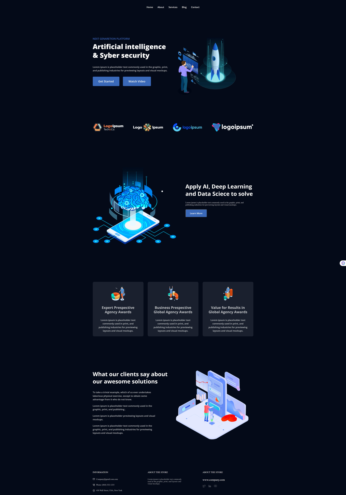

## Урок 8. Семинар. Основы позиционирования (вебинар) (домашняя работа)

Мы продолжаем работать с проектом из прошлого урока https://www.figma.com/file/3jcBxpXXVlwvD3bY16lbLW/Landing_Page-(Copy)-(Copy)?node-id=0%3A1&mode=dev

В данном домашнем задании мы будем добавлять стилистику и позиционирование для верхнего блока сайта

1. Для всех html-элементов из прошлого урока, вам необходимо задать стили в соответствии с макетом.

2. Расставить все элементы в соответствии с макетом.

Результат: 

